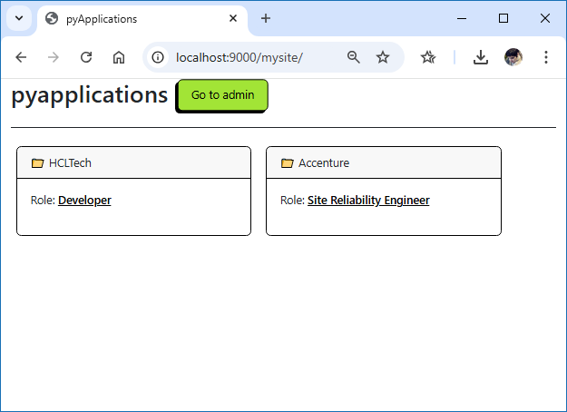

# pyapplications
Django project to manage multiple Job applications

- To run application in your computer type in the following commands:
python manage.py runserver 9000

- To insert/manage records into database go to Django's admin site:
localhost:9000/admin

- User is: admin
- Password: numbers 1 through 6

- To view your applications go to
localhost:9000/mysite

